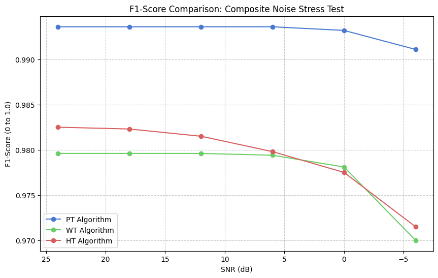

ECG QRS Detection: A Comparative Robustness Study

Benchmarking Pan-Tompkins, Wavelet, and Hilbert Transforms under Extreme Noise

This repository contains a comprehensive research framework for evaluating the performance of three classical QRS detection algorithms: Pan-Tompkins, Wavelet Transform (db4), and the Hilbert Transform. The study focuses on their resilience across various noise profiles (Baseline Wander, Muscle Artifacts, and Electrode Motion) using the MIT-BIH Arrhythmia Database and the MIT-BIH Noise Stress Test Database (NSTDB).

Summary

The Survivor: Pan-Tompkins is the most stable across moderate noise (Baseline Wander & Muscle Artifacts).

The Specialist: Wavelet and Hilbert Transforms maintain clinical relevance in Electrode Motion scenarios where derivative-based methods fail.

🚀 Getting Started

Prerequisites

Python 3.8+

pip install -r requirements.txt

Data Setup

Place the MIT-BIH and NSTDB files in the data/ directory:

data/mitdb/

data/nstdb/

Running the Analysis

To execute the full benchmarking suite and generate results:

python main.py

🛠 Project Structure

src/: Core logic including detectors.py, evaluator.py, and noise_utils.py.

tests/: Individual scripts for isolated noise stress tests.

notebooks/: Visualization of ECG signal distortion and performance curves.

results/: CSV output containing performance metrics across all SNR levels.

🧠 Discussion & Limitations

This study highlights the trade-off between computational efficiency and noise immunity. While the Pan-Tompkins algorithm is ideal for real-time edge processing on low-power wearables, transform-based methods are required for clinical-grade reliability in ambulatory settings where Electrode Motion mimics the QRS complex.

Future Work: - Implementing a Hybrid/Switching model that activates Wavelet denoising based on accelerometer-detected motion.

Transitioning to TinyML Convolutional Neural Networks for non-linear noise rejection.

📝 License

This project is licensed under the MIT License.

🤝 Contact

Divine Matengambiri – [www.linkedin.com/in/divine-matengambiri] – [matengambiridivine8@gmail.com]